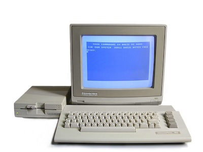

# c64-basic-snippets
Small snippets of Commodore64 BASIC code, random bits of BASIC code for testing machines or running development tests.

## Sound Routines

[TheDrone](sound/thedrone.md) - A repetitive droning sound with colour cycling.

